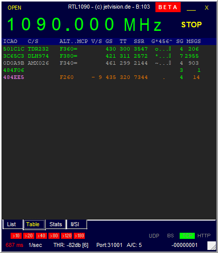

**ADS-B **stands for Automatic Dependent Surveillance–Broadcast and is transmitted by planes equipped with ADS-B-Out. The signal is broadcast on 1090MHz and includes the aircraft's GPS and avionics systems:
- Plane's position
- Altitude
- Heading
- Speed
- Flight ID

I used the RTL-SDR Blog V4 receiver, RTL1090 decoder and Virtual Radar Server. See [https://www.rtl-sdr.com/adsb-aircraft-radar-with-rtl-sdr/](RTL-SDR Tutorial) for more details.

### Install RTL1090

I downloaded the RTL1090 - IMU (Installer and Maintenance Utility) from [https://rtl1090.com/](https://rtl1090.com/). This gathered the files needed as well as zadig for installing the RTL-SDR drivers.

For some reason RTL1090 didn't pick up my RTL-SDR and I needed to install the drivers again with zadig.

The RTL1090 software requires some additional files. 
- libusb-1.0.dll
- rtlsdr.dll
- msvcr100.dll

Whilst the website says the can be downloaded from [http://web.archive.org/web/20130121051904/http://sdr.osmocom.org/trac/attachment/wiki/rtl-sdr/RelWithDebInfo.zip] these were out of date now. The versions that worked could be downloaded from the [https://github.com/rtlsdrblog/rtl-sdr-blog/releases](RTL-SDR Blog Driver GitHub releases page). The files above are available in the **x86** directory - just copy them into the directory with RTL1090.

Once installed, run the application and allow the firewall access pop up (this will be needed for Virtual Radar Server to connect). Click the **START** button and it should connect to the RTL-SDR and tune to 1090. The port the application has opened up is shown at the bottom of the window (and will be needed in Virtual Radar Server).

Once running and some planes are close it will start to list them as below.

